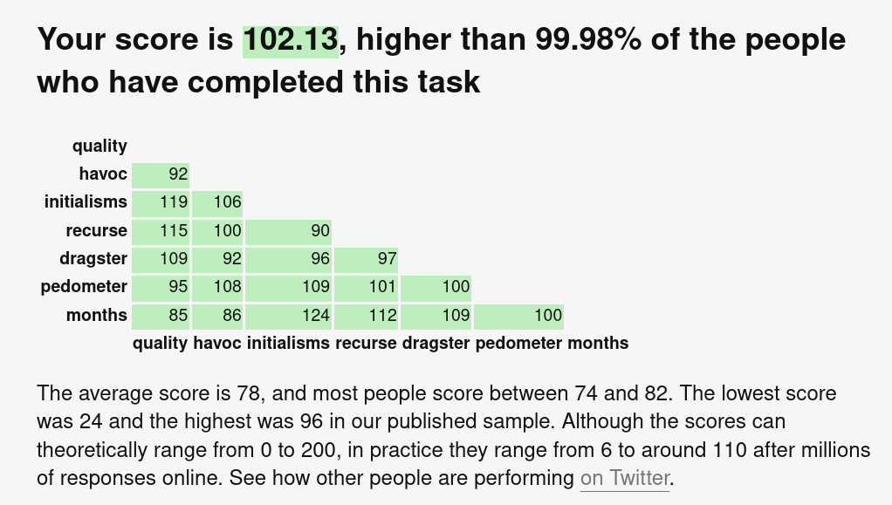

# semantic-calc

Calculate words semantically, by calculating with their embeds.

Motivation is to outscore all millions of humans on https://www.datcreativity.com/ (verbal creativity test) by finding maximally far away embeds. Work still in progress.

## Current record with this mini tool and some manual guidance

